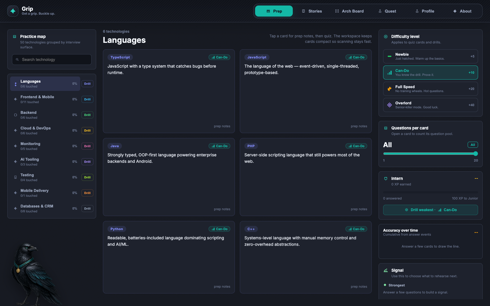
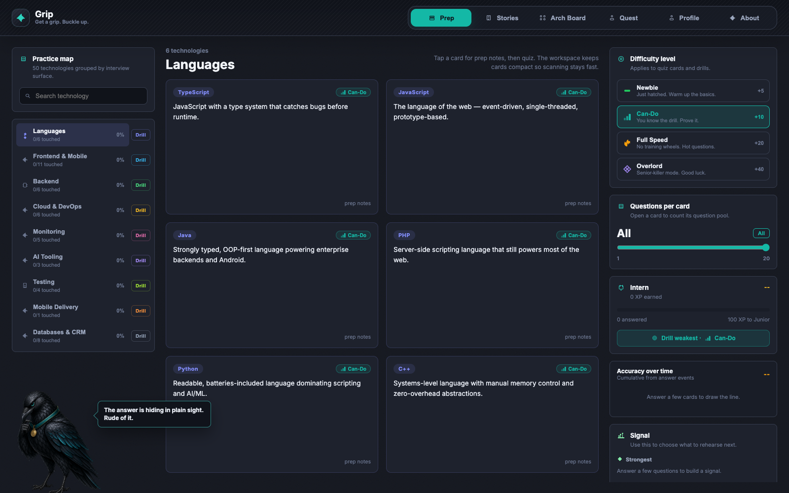
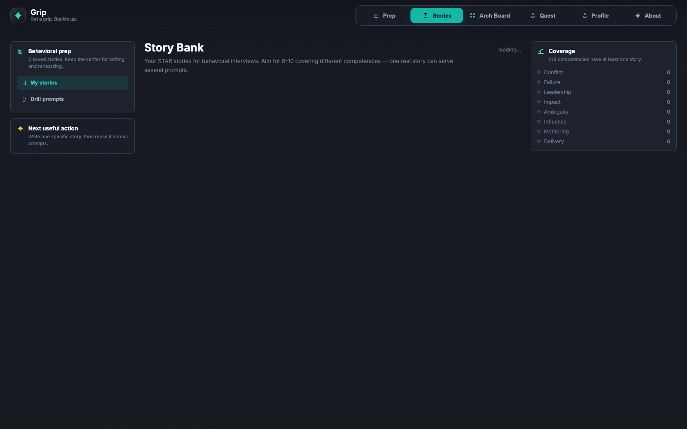
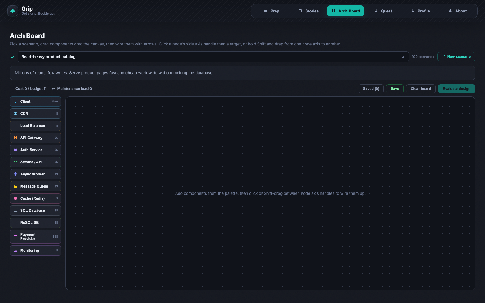
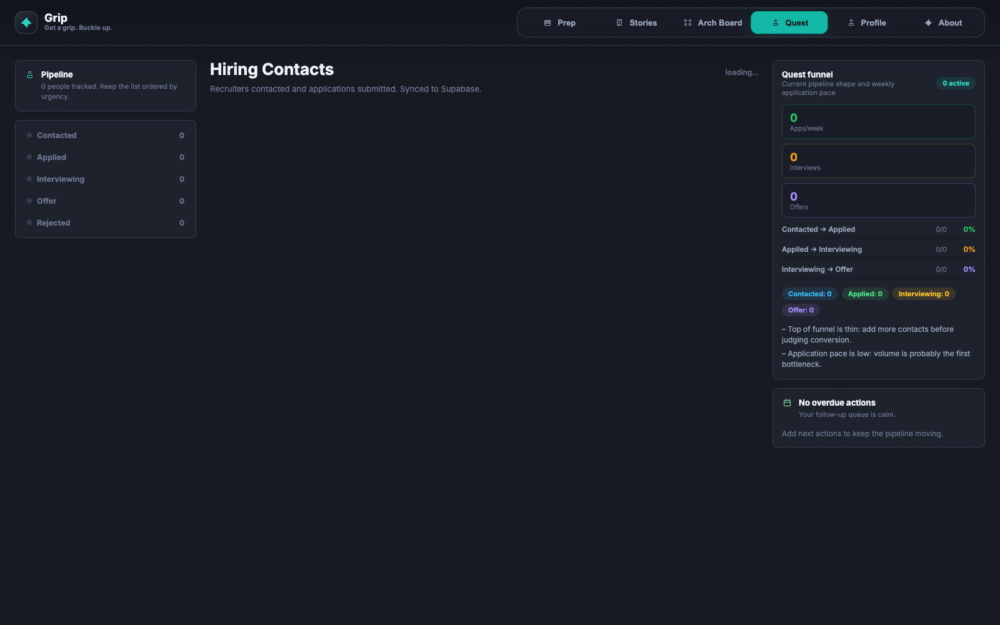
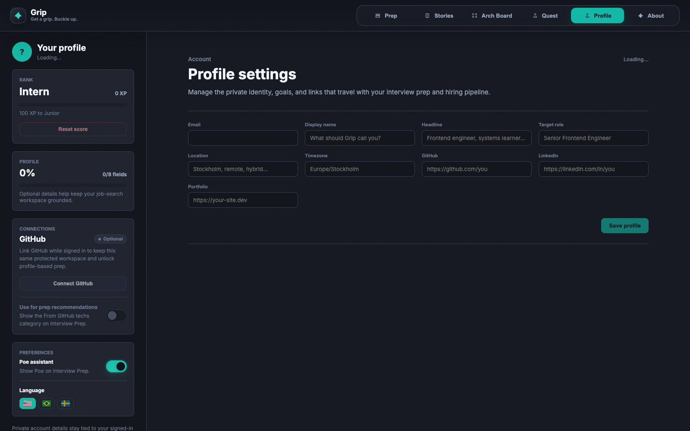
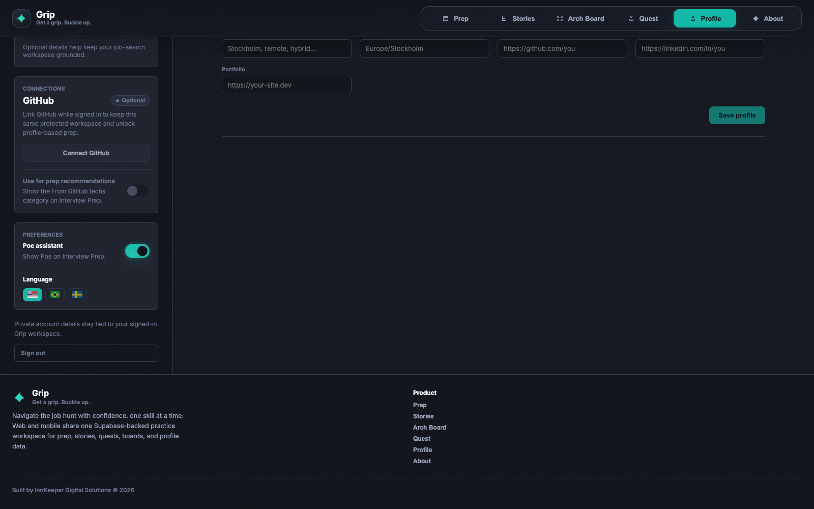

# Grip

Get a grip. Buckle up.

A full-stack interview prep and hiring pipeline manager - **web + React Native mobile** sharing one Postgres database via Supabase. Built as a **study case**, where each layer maps to an interview-prep topic.

## What It Does

### **Prep** tab
- Quiz cards for 50+ technologies across languages, frontend/mobile, backend, cloud, monitoring, AI, testing, mobile delivery, and databases/CRM
- Difficulty-aware drills targeting your weakest techs
- Gamified XP and ranks (Intern → Principal)
- Accuracy timeline: track your growth over time

### **Arch Board** tab
- System-design practice with interactive node-and-edge board
- 100 realistic scenarios plus user-authored custom scenarios
- Instant feedback: design checks, budget vs. cost, deployment complexity
- Mobile: Skia canvas + gesture-handler; Web: full edit mode

### **Stories** tab
- STAR interview prep: Conflict, Failure, Leadership, Impact, Ambiguity, Influence, Mentoring, Delivery
- Behavioral prompt drills with randomized cues
- Save your stories, tag by competency

### **Quest** tab
- Hiring pipeline tracker: Contacted → Applied → Interviewing → Offer → Rejected
- Link to job postings; notes and retrospectives per contact
- Funnel analytics: conversion rate, pace, due-soon highlighting
- DD-MM-YYYY date format for clarity

### **Profile** tab
- Private profile settings aligned with Supabase Auth
- Optional identity, goals, location, timezone, and portfolio/social links
- Score reset for local practice data

## Screenshots

Captured from the web app at 1600x1000 using `scripts/capture-web-screenshots.mjs`.

| Prep | Poe — raven guide |
| --- | --- |
|  |  |

| Stories | Arch Board |
| --- | --- |
|  |  |

| Quest | Profile |
| --- | --- |
|  |  |

| Footer |
| --- |
|  |

## Tech Stack

| Layer | Choice | Why |
| --- | --- | --- |
| **Backend** | Supabase (Postgres + PostgREST + Auth + RLS) | One DB, two clients; RLS = auth study case |
| **Repo** | pnpm workspaces monorepo | Web + mobile share quiz content, scoring logic |
| **Web** | Vite + React | Fast dev loop, simple build |
| **Mobile** | Expo + expo-router | Native feel, tabbed navigation, Reanimated 3D, Skia canvas |
| **Server state** | TanStack Query | Caching, optimistic updates, retry — handles offline reads |
| **Design** | Dark-first, teal accent | Token-driven; mobile and web pixel-perfect aligned |
| **Testing** | Jest + React Native Testing Library, Maestro (E2E) | 100+ tests covering shared logic and mobile UI flows |

## Project Structure

```
grip/
├── apps/
│   ├── mobile/                 # Expo app (React Native)
│   │   ├── src/app/            # expo-router (nested)
│   │   ├── src/components/     # Screens, forms, layouts
│   │   ├── src/theme.ts        # Token re-exports
│   │   └── jest.setup.js       # Mocks (Skia, Reanimated, etc.)
│   └── web/                    # Vite + React
│       ├── src/                # Pages, components, hooks
│       └── vite.config.js      # SSR-less single-page
├── packages/
│   └── core/                   # Shared logic
│       ├── src/
│       │   ├── prepData.js     # 80+ tech quiz content
│       │   ├── questions.js    # JSON-backed difficulty question bank
│       │   ├── scenarios.js    # 100 default Arch Board scenarios
│       │   ├── arch.js         # Evaluator, custom checks, node types
│       │   ├── stories.js      # STAR competencies, prompts
│       │   ├── contacts.js     # Pipeline lifecycle, date rules
│       │   ├── quiz.js         # Shuffle, drill-building
│       │   ├── difficulty.js   # Drill tiers and XP rewards
│       │   ├── funnel.js       # Conversion analytics
│       │   ├── accuracy.js     # XP timeline
│       │   ├── gamification.js # Ranks, XP points
│       │   ├── user.js         # Profile form mapping
│       │   ├── i18n.js         # Strings (English-only, extensible)
│       │   ├── tokens.js       # Design tokens (colors, spacing, font sizes)
│       │   ├── api.js          # Data layer (Supabase CRUD)
│       │   ├── techLinks.js    # Reference URLs
│       │   └── __tests__/      # Core domain and API tests
│       └── data/questions/     # Reviewable question-bank JSON
├── supabase/
│   └── migrations/             # SQL schema (contacts, retros, stories, answer_events)
├── docs/screenshots/web/       # Captured web product screens
├── scripts/
│   └── capture-web-screenshots.mjs
├── DESIGN.md                   # Design system & token reference
├── PLAN.md                     # Phases, decisions, study-case map
├── package.json                # Workspace root
├── pnpm-workspace.yaml         # Monorepo config
└── pnpm-lock.yaml              # Locked deps (pnpm@10.6.5)
```

## Getting Started

### Prerequisites
- **Node 22+** (via nvm or Homebrew)
- **pnpm@10.6.5** (enforced via Corepack)
- **Xcode 15+** (for iOS simulator)
- **Android Studio** (for Android simulator, optional)
- **Supabase account** (free tier sufficient)

### Installation

```bash
# Install dependencies
pnpm install

# Set up Supabase
# 1. Create a Supabase project at https://supabase.com
# 2. Copy your project URL and anon key
# 3. Create a .env file in apps/web and apps/mobile:
VITE_SUPABASE_URL=https://your-project.supabase.co
VITE_SUPABASE_ANON_KEY=eyJhbGc...

# 4. Run migrations (one-time)
cd supabase
# Run migrations manually via Supabase dashboard, or use:
# supabase db push (requires supabase-cli)

# 5. Seed the database (optional — prepopulate the question table)
SUPABASE_URL=https://your-project.supabase.co \
SUPABASE_SERVICE_ROLE_KEY=... \
node scripts/seed-questions.mjs
```

### Development

```bash
# Start web dev server (Vite)
pnpm dev

# Start mobile dev server (Expo Go via LAN)
pnpm mobile

# Run all tests
pnpm test

# Typecheck
pnpm typecheck

# CI (lint + test + typecheck + build)
pnpm run ci

# Run iOS simulator (native dev client, Skia support)
pnpm exec expo run:ios

# Run Android emulator
pnpm exec expo run:android
```

### Capture Web Screenshots

With the web dev server running, capture the README screenshots:

```bash
pnpm --filter web dev --host 127.0.0.1 --port 5174
node scripts/capture-web-screenshots.mjs http://127.0.0.1:5174/
```

The script writes PNGs to `docs/screenshots/web/`. It injects a local-only browser session for documentation captures; it does not create a Supabase account or write app data.

## Design System

All visual tokens live in [`packages/core/src/tokens.js`](packages/core/src/tokens.js):

- **Colors**: Dark elevation ladder (bgDeep → bg → surface → surfaceHi) + text grades + brand teal + status colors (success, danger, warning)
- **Typography**: `caption` (10px) → `display` (28px); all weights are string literals in code
- **Spacing**: `xs` (4px) → `xxl` (28px)
- **Radii**: `sm` (8px), `md` (12px), `lg` (16px), `pill` (999px)
- **Decorative**: Confetti ramp (6 teal-led colors for celebrations)

Both apps consume tokens identically — web accesses `@tech-refresh/core/tokens`, mobile re-exports via `@/theme`.

See [DESIGN.md](DESIGN.md) for full guidelines (elevation rules, contrast requirements, alpha-concat invariant).

## Key Modules

### `packages/core/src/quiz.js`
```js
export function buildDrillFromQuestions(questions, { size = 10 })
```
Builds a difficulty-aware drill from the JSON/Supabase question bank.

### `packages/core/src/arch.js`
```js
export function evaluate(scenario, nodes, edges)
```
Scores a system design against a scenario's checks, budget, and global design rules. Returns `{ checks, score, cost, maint, warnings }`.

### `packages/core/src/questions.js`
```js
export function normalizeQuestion(row)
```
Loads and validates the reviewable question-bank JSON used by web, mobile, tests, and optional Supabase seeding.

### `packages/core/src/api.js`
```js
export function createApi(supabase)
```
Data layer: wraps Supabase, handles snake_case ↔ camelCase mapping, date transformation (DD-MM-YYYY ↔ ISO), profile merging with Auth identity, RLS auth, and CRUD methods.

### `packages/core/src/gamification.js`
```js
export function rankForXp(xp)
export const CORRECT_XP = 10, PERFECT_QUIZ_BONUS = 30
```
Rank ladder (Intern at 0 XP → Principal at 1500 XP) and scoring rules.

## Database Schema

```sql
-- RLS on all tables: user_id = auth.uid()

contacts(
  id uuid pk, user_id uuid, name, status, role, link, note, date, 
  next_action, next_action_date, created_at
)

profiles(
  user_id uuid pk, email, display_name, avatar_url, headline, target_role,
  location, portfolio_url, github_url, linkedin_url, timezone,
  onboarding_completed, xp, created_at, updated_at
)

retros(
  id uuid pk, contact_id uuid fk, round, questions, went_well, 
  to_improve, created_at
)

stories(
  id uuid pk, user_id uuid, title, competency, situation, task, 
  action, result, created_at
)

answer_events(
  id uuid pk, user_id uuid, tech, correct bool, source text,
  difficulty text, created_at
)

questions(
  id uuid pk, tech, category, difficulty, prompt, options jsonb,
  correct int, explanation, created_at
)

saved_boards(
  id uuid pk, user_id uuid, title, scenario_id, nodes jsonb, 
  edges jsonb, created_at, updated_at
)

custom_scenarios(
  id uuid pk, user_id uuid, name, brief, budget, checks jsonb,
  created_at, updated_at
)

status_events(
  id uuid pk, user_id uuid, contact_id uuid fk, status text, 
  created_at
)
```

## Testing

### Core package (Jest, 102 tests)
```bash
pnpm --filter @tech-refresh/core test
```
Tests cover:
- Quiz mechanics, difficulty tiers, and question-bank invariants
- Arch evaluator, 100-scenario data checks, warnings, and edge detection
- Date rules (DD-MM-YYYY parsing, due highlighting)
- Funnel analytics (conversion rates, pace)
- Profile form mapping and API layer (mocked Supabase client)

### Mobile (RNTL, 7 tests)
```bash
pnpm --filter mobile test
```
Covers: Prep screen, quiz flow, drill session, stats bar, accuracy chart.

### E2E (Maestro, smoke tests)
```bash
pnpm exec maestro test apps/mobile/.maestro/smoke.yaml --appId <expo-app-id>
```
Covers: sign-in, bottom tabs, and CRUD smoke paths.

## Quality Assurance

### Type Safety
- TypeScript `strict` mode enabled on mobile
- JSDoc types for core modules
- No `any` types in the codebase

### Error Handling
- Try/catch around async mutations
- Null checks on ref-based DOM access (ArchBoard canvas)
- Division by zero prevention (buildDrill)

### Linting
Run checks before commit:
```bash
pnpm run ci
```

## Study Case: Interview Topics Covered

Each component/module is a study case for a real topic:

| Topic | Location | Why it matters |
| --- | --- | --- |
| **pnpm + Corepack** | `pnpm-workspace.yaml` | Monorepo dependency management; reproducible builds |
| **Postgres + RLS** | `supabase/migrations/` | Row-level security = authorization at the DB edge |
| **PostgREST API** | `packages/core/src/api.js` | Declarative REST from SQL; schema = API contract |
| **JWT + Auth** | Supabase magic-link | Stateless auth; RLS policies gated by `auth.uid()` |
| **TanStack Query** | `apps/*/src/` | Server state: caching, dedup, optimistic updates, offline |
| **React Compiler** | `apps/mobile/app.json` | Auto-memoization; shipping smaller JS bundles |
| **Reanimated worklets** | `apps/mobile/src/components/` | JSI (JS ↔ native bridge); 60fps animations |
| **Skia canvas** | `apps/mobile/src/components/board/` | GPU rendering; gesture-driven 2D graphics |
| **System design** | `packages/core/src/arch.js` | Practical scenarios: cost vs. reliability vs. complexity |
| **Spaced repetition** | `packages/core/src/quiz.js` | Learning science: low-accuracy techs appear first |

## CI/CD

The repo uses one required GitHub Actions workflow, `CI / Run checks`, to keep pull requests readable and avoid repeated dependency installs.

The consolidated gate runs:
1. `pnpm lint` — ESLint across the workspace
2. `pnpm test` — Jest on core + mobile
3. `pnpm typecheck` — TypeScript checks for mobile + web
4. `pnpm build` — Web production build

The workflow also uses read-only repository permissions, cancels superseded PR runs, and has a 15-minute timeout. CodeQL may still run from GitHub code-scanning settings, but it is separate from the repo workflow files.

## Deployment

### Web
```bash
pnpm build
```
Outputs to `apps/web/dist/`. Deploy to Vercel, Netlify, or any static host.

### Mobile (iOS/Android)
```bash
pnpm exec eas build
```
Requires EAS account. Outputs `.ipa` (iOS) or `.aab` (Android) for TestFlight / Play Store.

**OTA updates** (Expo Updates) are intentionally parked — the app ships pinned Expo SDK versions for predictability.

## Contributing

When adding features:
1. Add logic to `packages/core` (shared by both apps)
2. Add tests in `__tests__/`
3. Consume in `apps/mobile` and `apps/web` independently
4. Update design tokens if colors/spacing change
5. Run `pnpm run ci` before commit

## Files to Read First

1. [DESIGN.md](DESIGN.md) — Visual identity and token reference
2. [PLAN.md](PLAN.md) — Architecture decisions and phases
3. [packages/core/src/tokens.js](packages/core/src/tokens.js) — Design system
4. [packages/core/src/api.js](packages/core/src/api.js) — Data layer entry point
5. [apps/mobile/src/app/_layout.tsx](apps/mobile/src/app/_layout.tsx) — Mobile routing

## License

MIT (personal project, open sourced for learning).

---

**Last updated:** June 17, 2026<br>
**Status:** Phase 5 in progress (polish & delivery; EAS/OTA parked)<br>
**Committed:** All phases 0-4 complete; 100+ tests; consolidated CI; refreshed web screenshots
