# System Design — Grip

> Interview prep + job hunt toolkit. Cross-platform monorepo (web + mobile) backed by Supabase.

---

## 1. Monorepo Overview

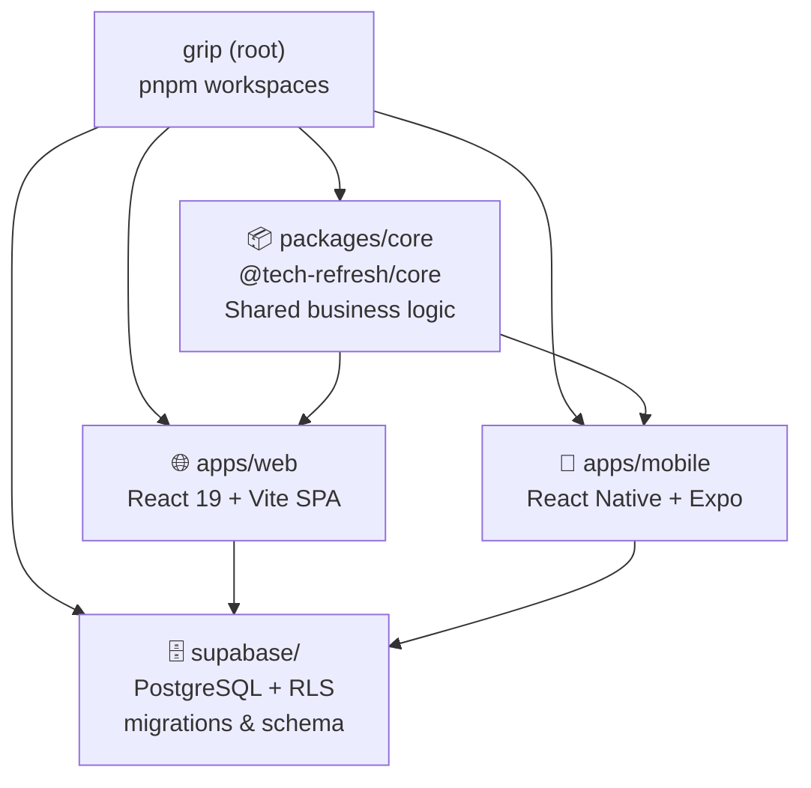

---

## 2. Authentication Flow

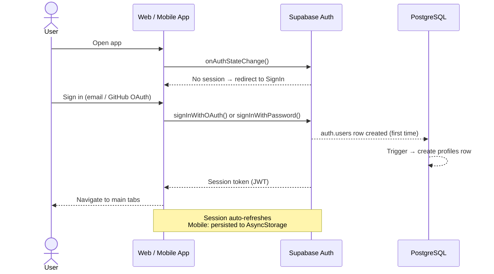

---

## 3. Core Package — Module Map

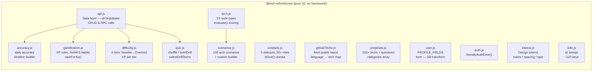

---

## 4. Web App — Tab Structure

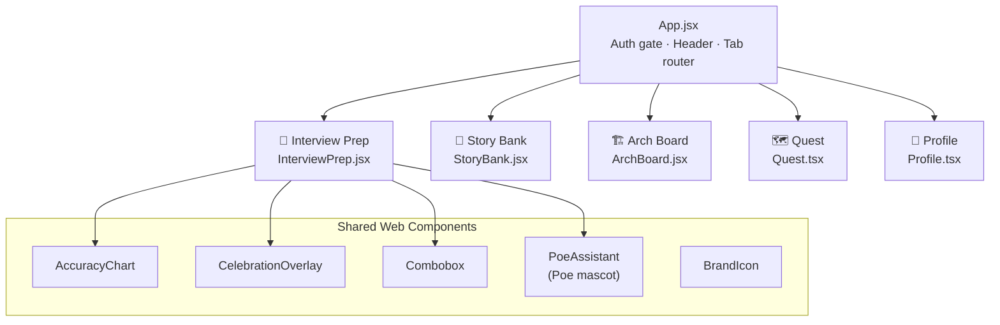

---

## 5. Mobile App — Tab Structure

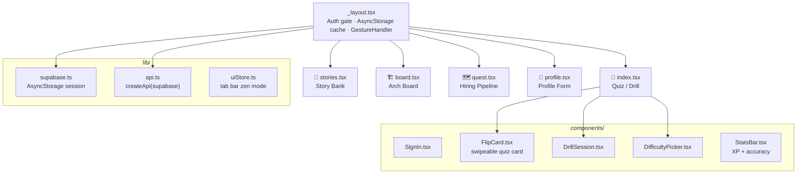

---

## 6. Data Layer — API Surface

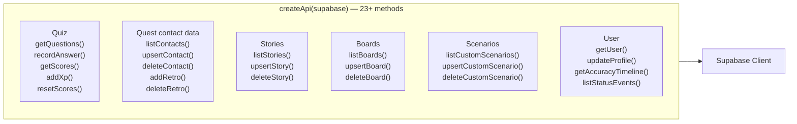

---

## 7. Database Schema

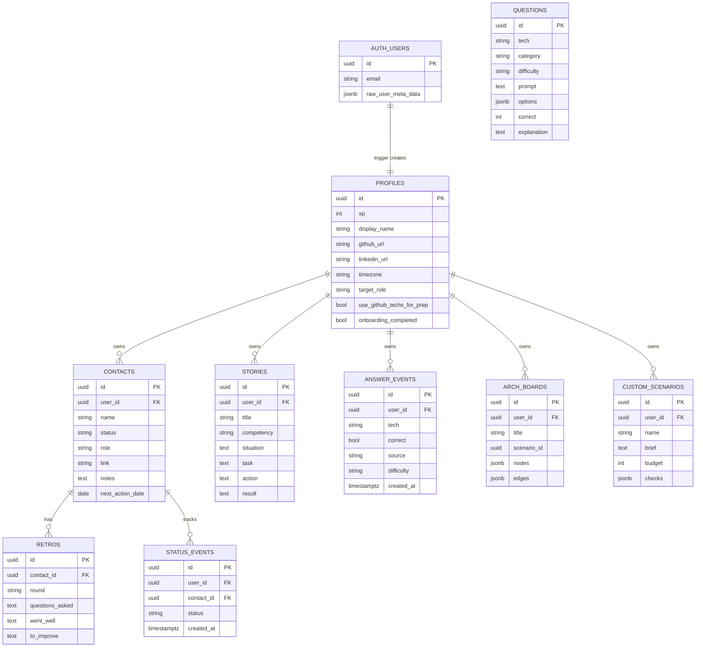

---

## 8. Quiz / Drill Data Flow

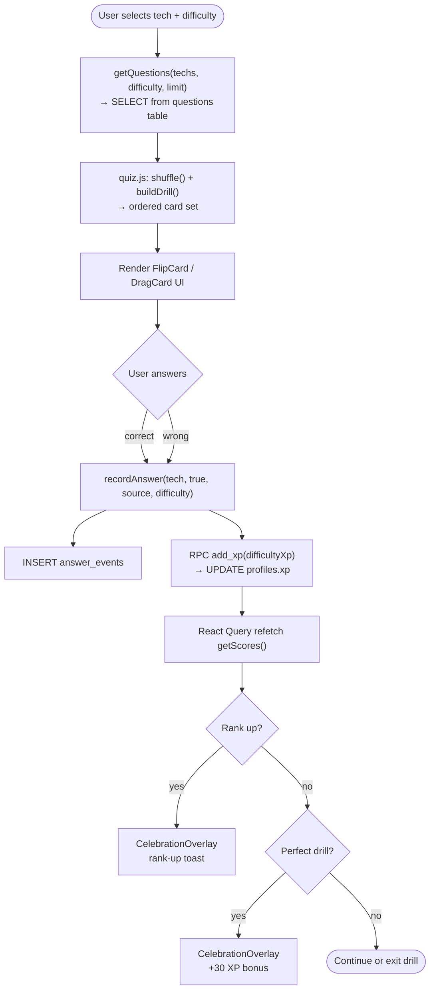

---

## 9. GitHub Tech Signal Flow

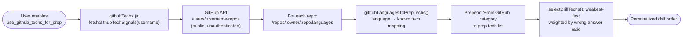

---

## 10. Hiring Pipeline Flow

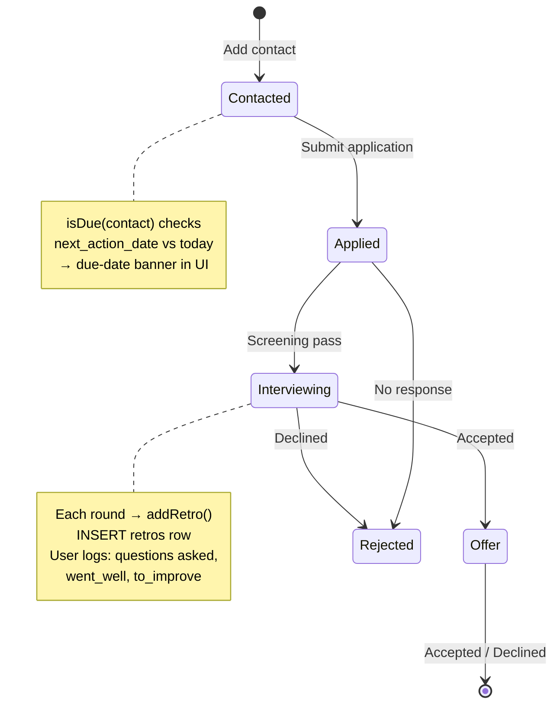

---

## 11. Architecture Board Flow

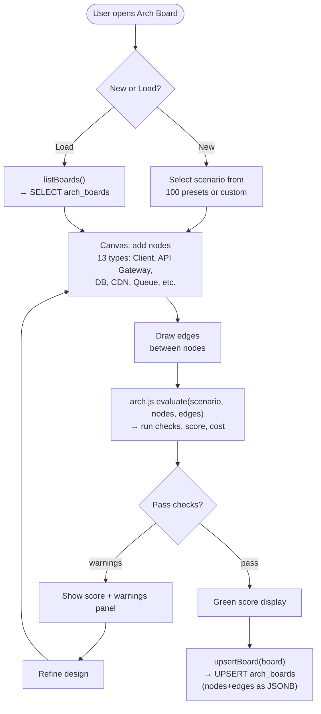

---

## 12. State Management

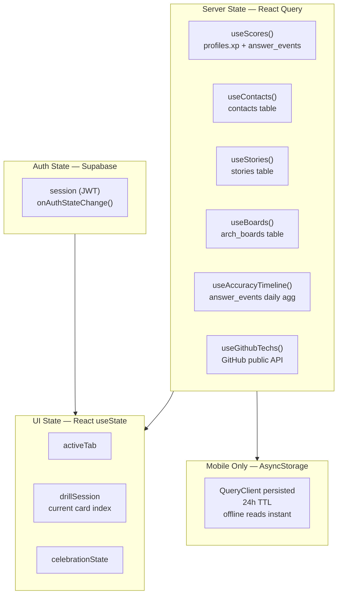

---

## 13. Full System Overview

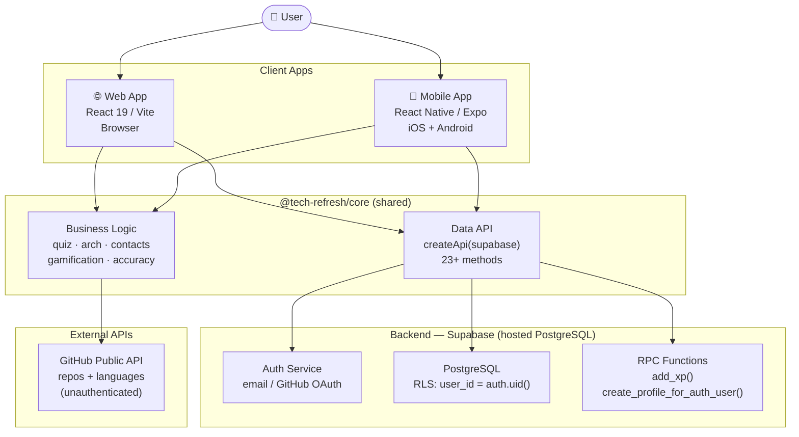
